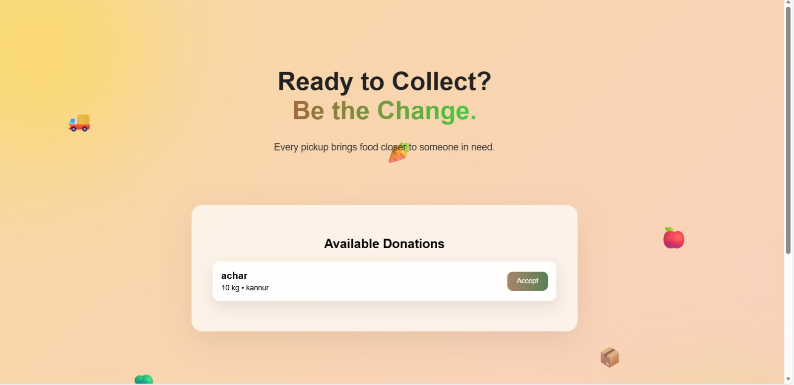
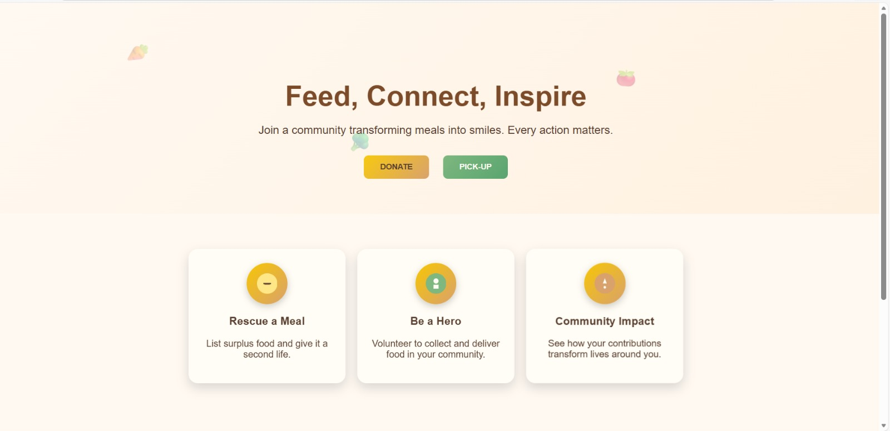
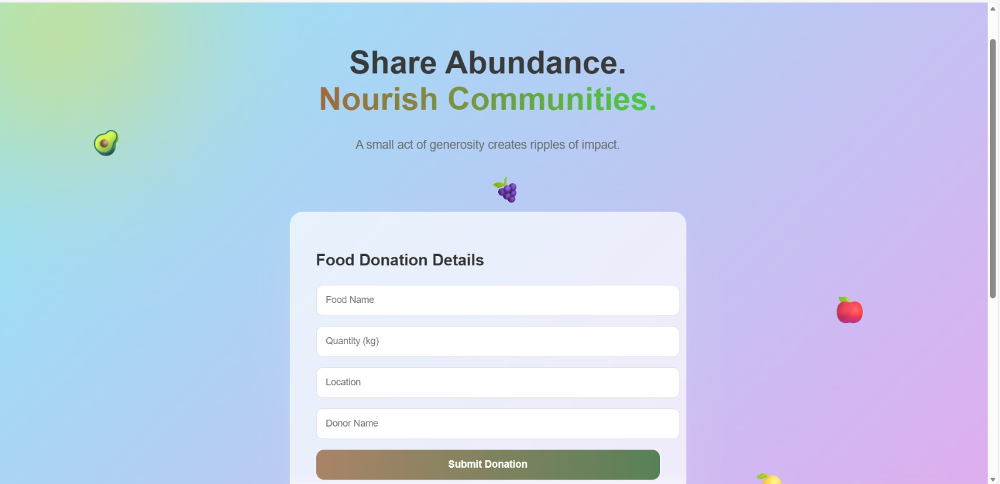
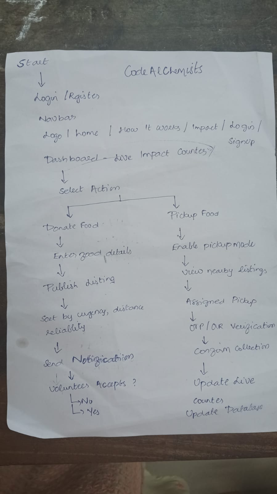

<!-- # React + Vite

This template provides a minimal setup to get React working in Vite with HMR and some ESLint rules.

Currently, two official plugins are available:

- [@vitejs/plugin-react](https://github.com/vitejs/vite-plugin-react/blob/main/packages/plugin-react) uses [Babel](https://babeljs.io/) (or [oxc](https://oxc.rs) when used in [rolldown-vite](https://vite.dev/guide/rolldown)) for Fast Refresh
- [@vitejs/plugin-react-swc](https://github.com/vitejs/vite-plugin-react/blob/main/packages/plugin-react-swc) uses [SWC](https://swc.rs/) for Fast Refresh

## React Compiler

The React Compiler is not enabled on this template because of its impact on dev & build performances. To add it, see [this documentation](https://react.dev/learn/react-compiler/installation).

## Expanding the ESLint configuration

If you are developing a production application, we recommend using TypeScript with type-aware lint rules enabled. Check out the [TS template](https://github.com/vitejs/vite/tree/main/packages/create-vite/template-react-ts) for information on how to integrate TypeScript and [`typescript-eslint`](https://typescript-eslint.io) in your project. -->


# FeedLoop 🍃

## Basic Details

### Team Name: [Insert Your Team Name]

### Team Members

* Member 1: Aysha Lina  - RIT Kottayam
* Member 2: Anamika S - RIT Kottayam

### Hosted Project Link

Hosted but not fully configured yet.

### Project Description

FeedLoop is a community-driven food redistribution platform designed to bridge the gap between surplus food donors and local volunteers. Using a real-time tracking system, it transforms potential waste into valuable community resources through a seamless "Eco-Rescue" digital interface.

### The Problem statement

Every year, massive amounts of perfectly edible food are wasted, contributing to high  emissions in landfills while local communities face food insecurity. Current redistribution methods are often manual, slow, or lack the real-time tracking necessary to handle perishable items before they expire.

### The Solution

We provide a full-stack platform that manages the complete lifecycle of food donations—**Available**, **Claimed**, and **Collected**. By capturing critical safety data like **shelf life** and **storage requirements**, FeedLoop ensures volunteers can prioritize and safely transport food to those in need, all while visualizing the community's environmental impact through live counters.

---

## Technical Details

### Technologies/Components Used

**For Software:**

* **Languages used:** JavaScript (ES6+)
* **Frameworks used:** React (Vite), Express.js
* **Libraries used:** Axios (Frontend API calls), Mongoose (MongoDB Object Modeling), dotenv (Environment variable management), CORS
* **Tools used:** VS Code, Git, MongoDB Atlas (Cloud Database), Postman (API Testing)

---

## Features

* **Lifecycle-Based State Management:** Tracks every food listing through a robust state machine (**Available** → **Claimed** → **Collected**) to ensure real-time accuracy and prevent duplicate claims.
* **Detailed Food Safety Profiling:** Captures critical safety data including **Shelf Life**, **Storage Requirements** (e.g., refrigeration), and **Food Categories** to assist volunteers in safe handling.
* **Live Sustainability Impact Dashboard:** Visualizes community contributions through dynamic counters for **Meals Saved**, **Kilograms Rescued**, and ** Prevented**.
* **Aesthetic "Eco-Rescue" UI:** A modern, "Glassmorphism" interface designed with a clean green-and-white palette to drive community engagement and trust.

---

## Implementation

### For Software:

#### Installation

```bash
# Install Backend dependencies
cd backend
npm install

# Install Frontend dependencies
cd ../frontend
npm install

```

#### Run

```bash
# Start Backend Server (runs on port 5000)
cd backend
npm start

# Start Frontend Development Server
cd frontend
npm run dev

```

---

## Project Documentation

### For Software:

#### Screenshots (Add at least 3)









#### Diagrams

**System Architecture:**

*FeedLoop follows an MVC architecture. The React frontend communicates via Axios with a Node.js/Express backend, which performs CRUD operations on a MongoDB Atlas cloud database.*

**Application Workflow:**


---

## Additional Documentation

### For Web Projects with Backend:

#### API Documentation

**Base URL:** `http://localhost:5000/api`

##### Endpoints

**POST /api/food/add**

* **Description:** Adds a new food listing to the platform.
* **Request Body:**

```json
{
  "food_name": "Veggie Biryani",
  "quantity": "5 plates",
  "food_type": "Cooked Meal",
  "shelf_life": "4 hours",
  "storage_info": "Keep refrigerated",
  "location": "Community Center A"
}

```

**GET /api/food**

* **Description:** Retrieves all listings currently in the "available" state.
* **Response:**

```json
{
  "status": "success",
  "data": [
    {
      "food_name": "Rice & Curry",
      "status": "available",
      "urgency": "High"
    }
  ]
}

```

**PUT /api/food/claim/:id**

* **Description:** Updates food status to 'claimed' to prevent duplicate pickups.

---

## Project Demo

### Video

[](./video.mp4)

*The video demonstrates the end-to-end flow: a donor listing food with specific shelf-life details, the dashboard impact counters updating, and a volunteer claiming the food via the pickup grid.*

---

## AI Tools Used

**Tool Used:** Gemini (Google)

**Purpose:**

* Debugging Vite import errors and path resolution.
* Generating the "Eco-Rescue" CSS theme and Glassmorphism components.
* Designing the lifecycle state logic for the backend.

**Key Prompts Used:**

* "Build a RESTful backend for a food redistribution platform using Node.js and MongoDB."
* "Create an aesthetic green and white login page with sustainability quotes."
* "Fix Vite error: Failed to resolve import ./Donate.css."

**Percentage of AI-generated code:** Approximately 40%

**Human Contributions:**

* System architecture planning and database schema design.
* Custom business logic for the food state machine.
* Brand identity and UI/UX refined adjustments.
* Integration and end-to-end testing.

---

## Team Contributions

* [Member 1]: Backend API development, MongoDB schema design, and lifecycle state management.
* [Member 2]: Frontend UI development, Axios integration, and "Eco-Rescue" CSS styling.

---

## License

This project is licensed under the MIT License.

---
